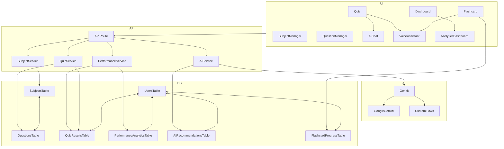

<div align="center">
  
  <h1>AkılHane - AI Destekli Eğitim Platformu</h1>
  <p>
    <strong>Öğrenme deneyiminizi kişiselleştiren, yapay zeka destekli yeni nesil eğitim platformu.</strong>
  </p>
  <p>
    <a href="https://your-live-demo-url.com"><strong>Canlı Demoyu Ziyaret Et »</strong></a>
  </p>
  <br>
</div>

<!-- Optional: Add a GIF of the app in action -->
<!-- <div align="center">
  
</div> -->

## ✨ Neden AkılHane?

AkılHane, standart eğitim platformlarının ötesine geçerek her öğrencinin bireysel ihtiyaçlarına odaklanır. Sadece soru çözmekle kalmaz, **zayıf yönlerinizi tespit eder, size özel çalışma stratejileri sunar ve öğrenme sürecinizi akıllı bir asistanla destekler.** Amacımız, eğitimi daha verimli, erişilebilir ve kişisel hale getirmektir.

Bu proje, **BTK Akademi & Google Cloud & Girişimcilik Vakfı Hackathon'25** için geliştirilmiştir.

## 🚀 Ana Özellikler

-   🧠 **Kişiselleştirilmiş Öğrenme Asistanı:** Performansınıza göre size özel testler ve konular öneren akıllı sistem.
-   튜 **AI Tutor ile Anında Yardım:** Anlamadığınız sorularda size ipuçları veren, adım adım çözüm sunan ve konuyu özetleyen yapay zeka öğretmeni.
-   💬 **Etkileşimli AI Sohbet:** Ders konuları hakkında yapay zeka ile sohbet etme ve derinlemesine bilgi alma imkanı.
-   🃏 **Akıllı Flashcard'lar:** Spaced Repetition (Aralıklı Tekrar) algoritması ile çalışan, öğrenmenizi optimize eden dijital kartlar.
-   📊 **Detaylı Performans Analizi:** Gelişiminizi takip edebileceğiniz görsel grafikler ve istatistikler.
-   🎤 **Sesli Asistan Desteği:** "Soru oku", "cevabı göster" gibi komutlarla uygulamayı sesle kontrol etme.
-   📱 **PWA (Progressive Web App):** Çevrimdışı çalışma ve mobil cihazınıza uygulama gibi kurma desteği.
-   ⚙️ **Kapsamlı Yönetim Panelleri:** Hem dersleri hem de soruları kolayca yönetebileceğiniz arayüzler.

## 🛠️ Kullanılan Teknolojiler

<div align="center">
  <a href="https://nextjs.org/" target="_blank"></a>
  <a href="https://react.dev/" target="_blank"></a>
  <a href="https://www.typescriptlang.org/" target="_blank"></a>
  <a href="https://tailwindcss.com/" target="_blank"></a>
  <a href="https://cloud.google.com/vertex-ai/docs/generative-ai/gemini/gemini-api" target="_blank"></a>
  <a href="https://firebase.google.com/docs/genkit" target="_blank"></a>
  <a href="https://orm.drizzle.team/" target="_blank"></a>
  <a href="https://supabase.com/" target="_blank"></a>
  <a href="https://www.sqlite.org/index.html" target="_blank"></a>
  <a href="https://www.radix-ui.com/" target="_blank"></a>
  <a href="https://www.framer.com/motion/" target="_blank"></a>
  <a href="https://web.dev/progressive-web-apps/" target="_blank"></a>
  <a href="https://www.i18next.com/" target="_blank"></a>
</div>

## 🏗️ Teknik Derinlik ve Mimari

Bu proje, modern ve ölçeklenebilir bir mimari üzerine kurulmuştur.

-   **Full-Stack Next.js 15:** Hem sunucu taraflı render etme (SSR) hem de istemci taraflı (CSR) yeteneklerini bir arada kullanarak yüksek performans ve esneklik sağlar.
-   **Type-Safe Veritabanı:** **Drizzle ORM** ve **SQLite** kullanarak tamamen tip güvenli bir veritabanı katmanı oluşturulmuştur. Bu, SQL injection gibi zafiyetleri engeller ve geliştirme sürecini hızlandırır.
-   **Gelişmiş AI Akışları:** **Genkit Framework** kullanılarak sadece basit API çağrıları yapılmamış, birden fazla AI modelini (Google Gemini, vb.) ve veri kaynaklarını birleştiren karmaşık "flow"lar tasarlanmıştır. Bu, AI çıktılarının daha güvenilir ve amaca yönelik olmasını sağlar.
-   **Modüler ve Bileşen Tabanlı Arayüz:** **Radix UI** ve **Tailwind CSS** kullanılarak hem erişilebilir hem de yeniden kullanılabilir, modern bir UI kütüphanesi oluşturulmuştur.

<details>
<summary><b>🗺️ Proje Genel Mimarisi (Mermaid Şeması)</b></summary>
<br>

Aşağıda, platformun ana modülleri ve veri akışlarını gösteren yüksek seviyeli bir mimari şema yer almaktadır:



> **Not:** Bu şema, platformun temel veri ve iş akışlarını yüksek seviyede özetler. Detaylı alt modül ilişkileri için kodu inceleyebilirsiniz.

</details>

<details>
<summary><b>📦 Kurulum ve Çalıştırma Adımları</b></summary>
<br>

1.  **Projeyi klonlayın:**
    ```bash
    git clone https://github.com/melihcanndemir/akilhane.git
    cd akilhane
    ```
2.  **Bağımlılıkları yükleyin:**
```bash
npm install
```
3.  **`.env.local` dosyasını oluşturun:** `.env.example` dosyasını kopyalayarak kendi Google AI anahtarınızı ekleyin.
    ```
    GOOGLE_API_KEY=your_google_api_key_here
    ```
4.  **Veritabanını hazırlayın ve başlatın:**
```bash
npm run db:generate
npm run db:init
```
5.  **Geliştirme sunucusunu başlatın:**
```bash
npm run dev
```
6.  Tarayıcınızda `http://localhost:9002` adresini açın.

</details>

<details>
<summary><b>🗄️ Veritabanı Yönetimi</b></summary>
<br>

-   **Migration Oluşturma:** Şemada değişiklik yaptığınızda yeni bir migration dosyası oluşturur.
```bash
npm run db:generate
```
-   **Migration'ları Uygulama:** Oluşturulan migration'ları veritabanına uygular.
```bash
npm run db:migrate
```
-   **Veritabanı Studio:** Veritabanını görsel bir arayüzde incelemek için.
```bash
npm run db:studio
```
</details>

<details>
<summary><b>📊 Veritabanı Şeması</b></summary>
<br>

-   **users**: Kullanıcı bilgileri
-   **subjects**: Ders konuları ve detayları
-   **questions**: Soru bankası, seçenekler ve açıklamalar
-   **quiz_results**: Kullanıcıların test sonuçları
-   **performance_analytics**: Konu bazlı performans analizleri
-   **ai_recommendations**: Kişiselleştirilmiş AI ders/konu önerileri
-   **flashcard_progress**: Flashcard'ların öğrenilme durumu

</details>

## 🤝 Katkıda Bulunma

Bu proje eğitime ve teknolojiye meraklı herkesin katkısına açıktır.

1.  Bu repoyu **fork**'layın.
2.  Yeni bir **feature branch** oluşturun (`git checkout -b feature/AmazingFeature`).
3.  Değişikliklerinizi **commit**'leyin (`git commit -m 'Add some AmazingFeature'`).
4.  Branch'inizi **push**'layın (`git push origin feature/AmazingFeature`).
5.  Bir **Pull Request** açın.

---
<div align="center">
  <p><strong>AkılHane</strong> - Bilginin ve Zekanın Buluştuğu Yer.</p>
</div>
